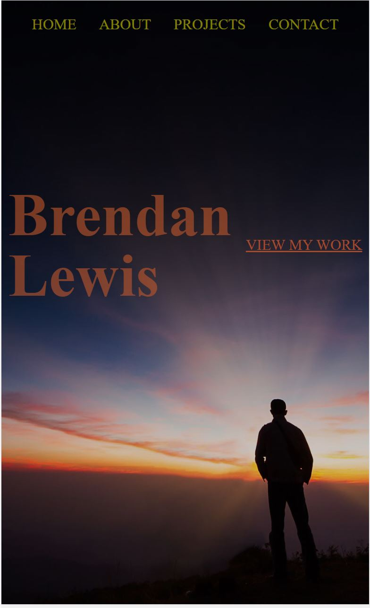

# Brassfolio

### Description

This is my personal portfolio!

### Table of Contents

- [Usage Guide](#Usage-Guide)
- [Install Instructions](#Installation)
- [Technologies Used](#Technologies-Used)
- [Contributions](#Contributions)
- [Tests](#Tests)
- [Questions](#Questions)

## Usage Guide

Browse my latest work and reach out if you would if you have any questions!

## Installation

With Node installed, open a new BASH terminal in the directory of the app and run NPM Install

`NPM Install`

Then just run NPM start to lauch the application

`NPM Start`

## Technologies Used

Node, React, Semantic-React-UI were used to create my portfolio

## Contributions

This is currently my own work. Please feel free to submit your contributions on GITHUB with credits given

## Tests

Future testing planned using the JEST Framework

## Questions

If you have any questions or want to keep up with my latest projects, please follow me on [Github](http://www.github.com/operationBrass) or contact me via [Email](mr.brn.lewis@outlook.com).
